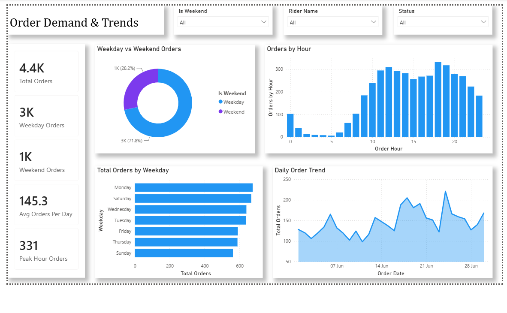
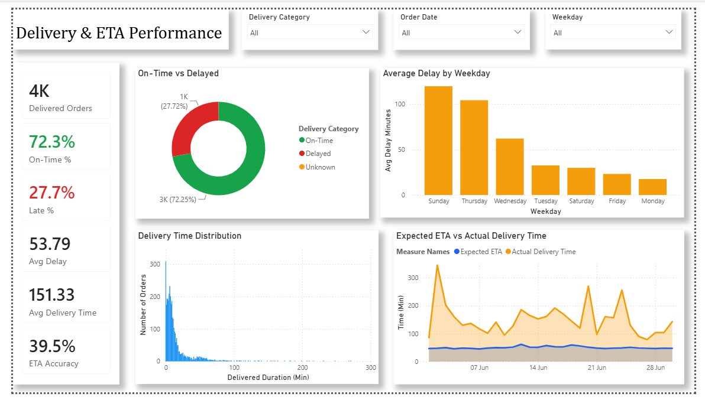
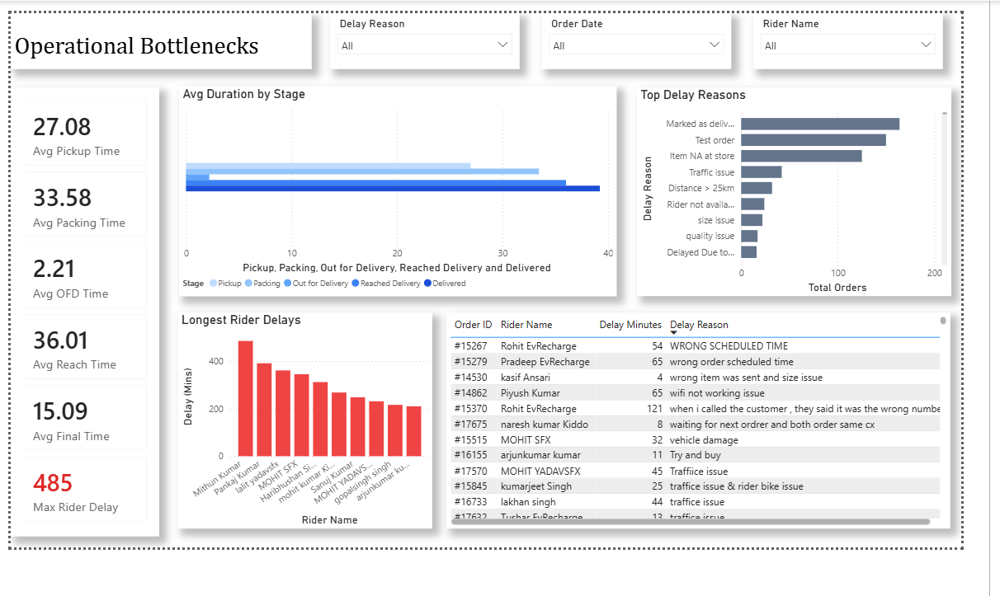
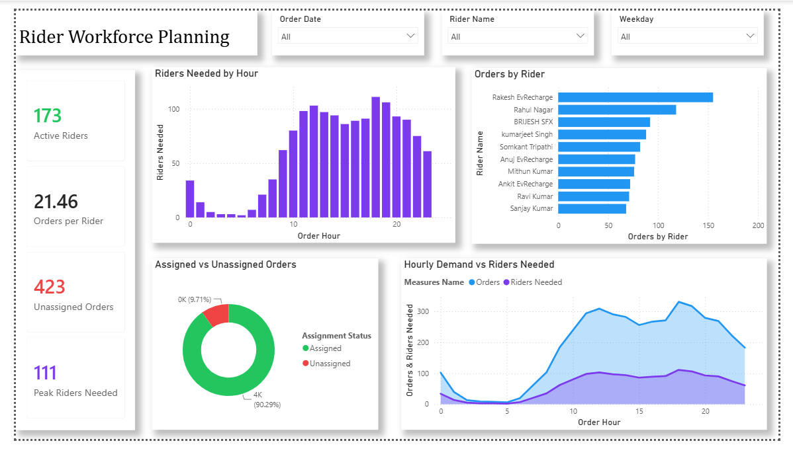

# Delivery Operations Dashboard

A Power BI analytics project analyzing quick-commerce delivery operations — covering order demand, delivery performance, operational bottlenecks, and rider workforce planning — built to turn raw operational data into decisions a delivery ops team can act on.


---

## Overview

This dashboard analyzes one month (June 2026) of delivery operations data to answer four core operational questions:

1. **When** do orders come in, and how does demand shift across the week and day?
2. **How well** is the business hitting its promised delivery times?
3. **Where** in the delivery pipeline do delays actually happen?
4. **How many riders** are needed, and when, to meet demand?

The result is a 4-page interactive dashboard built on a cleaned dataset, custom DAX measures, and a consistent visual design system — built as a report, not just a set of charts.

---

## Tools & Technologies

| Category | Tools |
|---|---|
| Data cleaning & transformation | Power Query (M) |
| Calculations & KPIs | DAX |
| Visualization | Power BI |
| Source data | Microsoft Excel |

---

## Dashboard Pages

### 1. Order Demand & Trends
Analyzes order volume patterns across time.

**Metrics:** Total Orders · Weekday Orders · Weekend Orders · Average Daily Orders · Peak Hour Orders

**Visuals:** Weekday vs. weekend split, orders by hour, orders by weekday, daily order trend over the month.

### 2. Delivery & ETA Performance
Evaluates how actual delivery performance compares to the promised ETA.

**Metrics:** Delivered Orders · On-Time Delivery % · Late Delivery % · Average Delay · Average Delivery Time · ETA Accuracy

**Visuals:** On-time vs. delayed breakdown, average delay by weekday, delivery-time distribution, expected ETA vs. actual delivery time.

### 3. Operational Bottlenecks
Identifies which stage of the delivery pipeline — and which operational factors — contribute most to delay.

**Metrics:** Avg. Packing Time · Avg. Pickup Time · Avg. Out-for-Delivery Time · Avg. Reach Time · Avg. Final Delivery Time · Longest Rider Delay

**Visuals:** Average duration by pipeline stage, top delay reasons, longest individual rider delays with order-level detail.

### 4. Rider Workforce Planning
Estimates rider requirements based on observed order demand and evaluates current rider utilization.

**Metrics:** Active Riders · Orders per Rider · Unassigned Orders · Peak Riders Needed

**Visuals:** Riders needed by hour, orders by rider, assigned vs. unassigned orders, hourly demand vs. estimated rider requirement.

---

## Data Preparation

Raw data was cleaned and transformed in Power Query before modeling. Key steps:

- Removed duplicate records
- Handled missing and null values
- Replaced invalid placeholder values
- Corrected data types
- Converted text-format durations into numeric minutes
- Derived date, hour, weekday, and weekend attributes
- Created delivery-status categories (On-Time / Delayed / Unknown)
- Created rider assignment categories (Assigned / Unassigned)

---

## Key Insights

- **~72%** of delivered orders were completed within the promised ETA; the remaining ~28% were delayed.
- Peak hourly demand reached approximately **331 orders**, concentrated in the afternoon–evening window.
- **Sunday and Thursday** show the highest average delivery delays, while Monday and Friday perform best.
- Delay duration varies noticeably by pipeline stage, pointing to specific operational stages as primary bottlenecks rather than delays being evenly distributed.
- Rider requirements scale sharply with demand — the gap between available and needed riders widens most during peak hours.
- A meaningful share of orders went **unassigned**, indicating a gap between rider capacity and order volume during peak periods.

---

## Rider Capacity Assumption

Rider workforce estimates assume **one rider can handle approximately 3 orders per hour**, based on observed average delivery and turnaround times.

At peak demand of **~331 orders/hour**, this implies a peak requirement of approximately **111 active riders** — compared to 173 currently active riders, suggesting scheduling/shift alignment, rather than headcount, is the more immediate lever for reducing unassigned orders.

---

## Data Quality Notes

- Delay reasons are captured as free-text entries by riders/ops staff and were **retained in their original form** to preserve source fidelity rather than being reclassified. As a result, some entries have inconsistent phrasing or overlapping meaning (e.g., variations in how "traffic issue" is written).
- A small number of extreme duration outliers (e.g., cancelled or test orders) were identified during analysis and handled at the visualization level — filtered or capped where needed — so they don't distort the operational metrics they'd otherwise skew.

---

## Dashboard Preview

### Order Demand & Trends


### Delivery & ETA Performance


### Operational Bottlenecks


### Rider Workforce Planning


---

## Repository Structure

```
Delivery-Operations-Dashboard/
├── README.md
├── Delivery_Operations_Dashboard.pbix
├── screenshots/
│   ├── order-demand-trends.png
│   ├── delivery-eta-performance.png
│   ├── operational-bottlenecks.png
│   └── rider-workforce-planning.png
└── dataset/
```

---

## Author

**Anjali Singh**
Power BI · Data Analytics · Data Visualization
